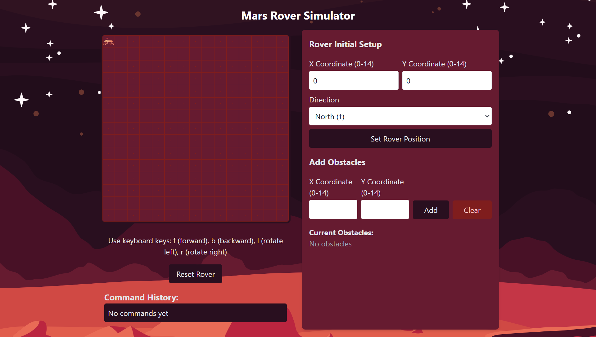

# Mars Rover Controller



A fun simulator that allows you to control a Mars Rover on a grid! Built with **React**, styled with **TailwindCSS**, and documented using **Storybook**.

## 🚀 Live Demo

Check out the live version here: [Mars Rover Simulator](https://mars-rover-controller.vercel.app/)

---

## 📦 Getting Started

### Installation

1. **Clone the repository**:
   ```bash
   git clone https://github.com/your-username/mars-rover-simulator.git
   ```

2. **Navigate into the project folder**:
   ```bash
   cd mars-rover-simulator
   ```

3. **Install dependencies:**:
   ```bash
   npm install
   ```

### Running the Project Locally

1. **Start the development server:**:
    ```bash
    npm start
    ```

2. **Run Storybook (Optional for component documentation)**:
    ```bash
    npm run storybook
    ```

### 🛠 Technologies Used

- React: Frontend framework.
- TailwindCSS: For styling.
- Storybook: For documenting and testing UI components.
- Redux: For state management.

### License
[MIT](https://opensource.org/licenses/MIT)

